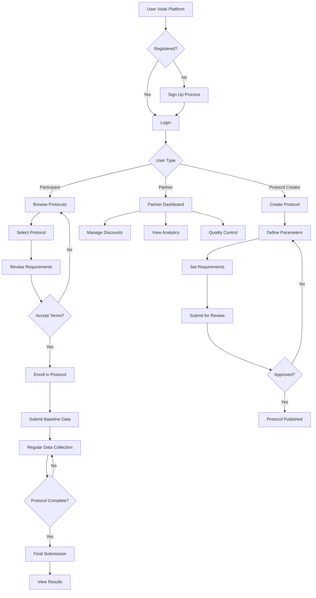
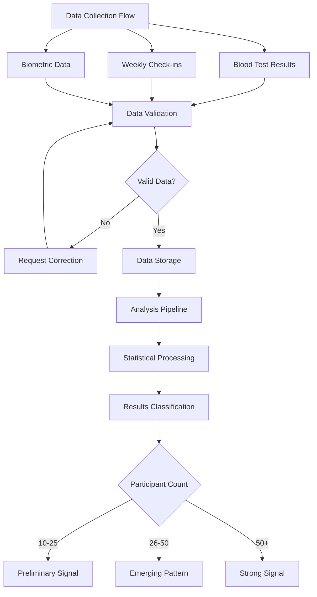
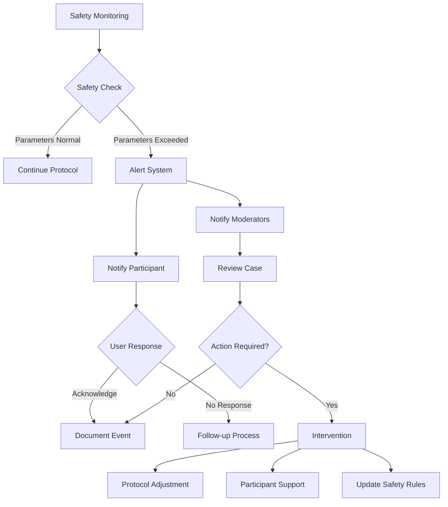
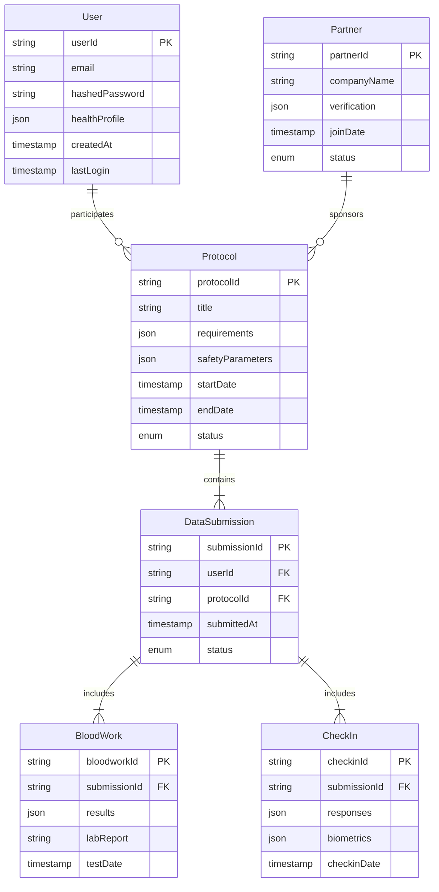
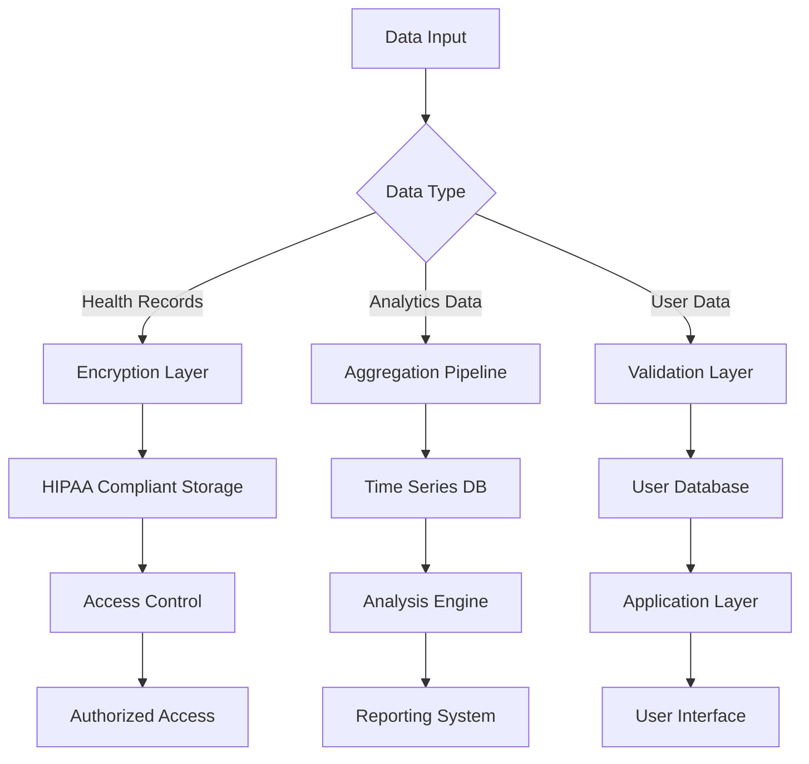
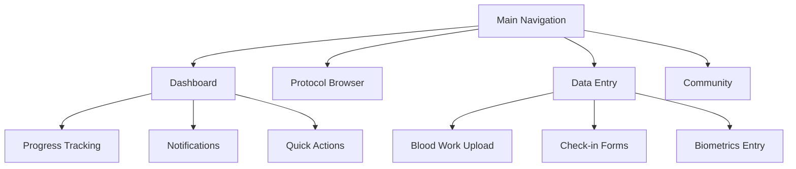
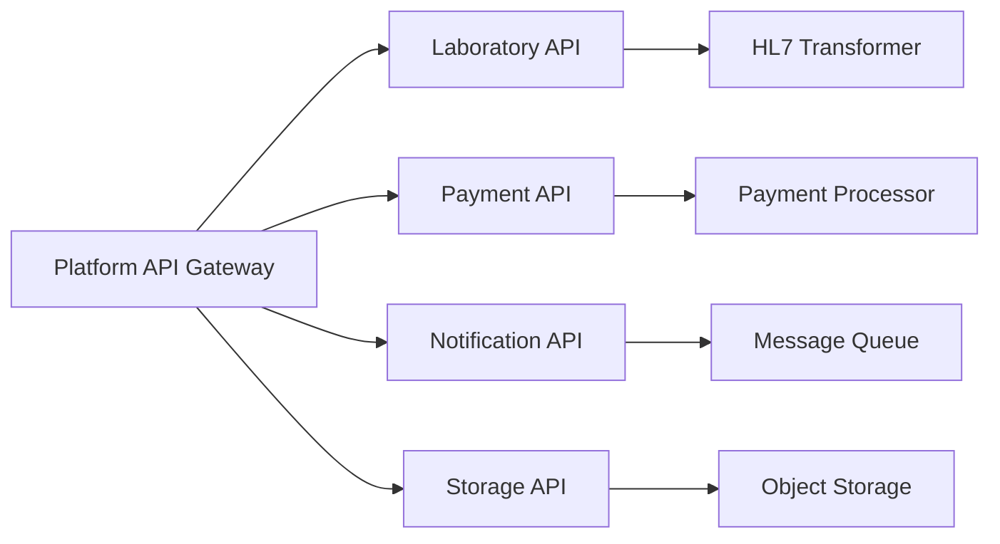
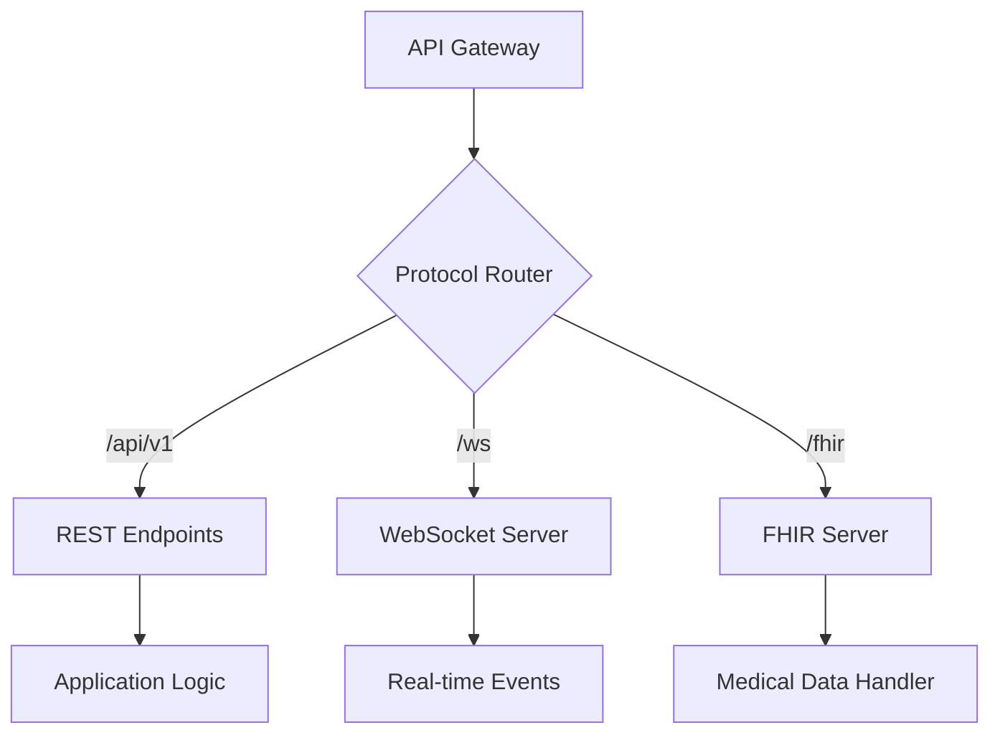

# Product Requirements Document (PRD)

# 1. INTRODUCTION

## 1.1 Purpose

This Software Requirements Specification (SRS) document provides a comprehensive description of the Medical Research Platform's implementation requirements. It serves as the primary reference for technical teams, stakeholders, and project managers involved in the development of the community-driven medical research platform.

## 1.2 Scope

The Medical Research Platform is a web-based system that facilitates community-driven medical research through structured observational studies ("unstudies"). The platform encompasses:

- Protocol Creation and Management

  - Standardized templates for study design
  - Blood work specifications
  - Intervention guidelines
  - Safety parameter definitions

- Participant Engagement Features

  - Protocol discovery and enrollment
  - Data submission interface
  - Progress tracking dashboard
  - Community interaction tools

- Data Collection and Analysis

  - Quantitative data gathering (blood tests, biometrics)
  - Qualitative data collection (check-ins, reports)
  - Results classification system
  - Basic statistical analysis

- Partnership Management

  - Supplement company verification
  - Discount code administration
  - Quality control monitoring
  - Data sharing capabilities

The initial release (Phase 1) focuses on the unstudies platform, with future expansion planned for formal, IRB-approved studies in Phase 2.

# 2. PRODUCT DESCRIPTION

## 2.1 Product Perspective

The Medical Research Platform operates as a standalone web-based system that interfaces with several external systems and stakeholders:

- Laboratory Information Systems (LIS) for blood test results integration
- Supplement company inventory and fulfillment systems
- Payment processing services for discount code redemption
- Email/notification delivery services
- Cloud hosting infrastructure

The system follows a microservices architecture pattern with vuejs frontend and Django ninja backend and maintains complete data isolation between different protocols and users.

## 2.2 Product Functions

- Protocol Management

  - Creation and modification of study templates
  - Participant enrollment and tracking
  - Data collection schedule management
  - Safety parameter monitoring

- User Data Management

  - Secure storage of health data
  - Blood test result uploads
  - Progress tracking
  - Report generation

- Community Features

  - Protocol-specific discussion forums
  - Experience sharing
  - Direct messaging between participants
  - Moderated content management

- Partnership Operations

  - Supplement company onboarding
  - Discount code generation and tracking
  - Quality control monitoring
  - Data sharing portal

## 2.3 User Characteristics

### Study Participants

- Age Range: 18-65
- Technical Proficiency: Basic to intermediate
- Health Interest Level: High
- Time Commitment: 1-2 hours per week
- Primary Motivation: Personal health optimization

### Protocol Creators

- Technical Proficiency: Intermediate
- Subject Matter Expertise: Advanced
- Platform Usage: 5-10 hours per week
- Primary Motivation: Community contribution and research

### Supplement Company Partners

- Technical Proficiency: Intermediate
- Business Focus: Health and wellness
- Platform Usage: 2-3 hours per week
- Primary Motivation: Product validation and market access

## 2.4 Constraints

### Technical Constraints

- Must support major web browsers (Chrome, Firefox, Safari, Edge)
- Mobile-responsive design requirement
- Maximum file size of 10MB for data uploads
- 99.9% uptime requirement

### Regulatory Constraints

- HIPAA compliance requirements
- GDPR data privacy standards
- FDA promotional guidelines for supplements
- Medical disclaimer requirements

### Business Constraints

- Initial launch budget of $10,000
- 6-month development timeline for MVP
- Maximum of 5 supplement company partnerships in Phase 1
- Community moderation staff limited to 2 FTEs

## 2.5 Assumptions and Dependencies

### Assumptions

- Users have reliable internet access
- Participants can obtain required blood tests
- Supplement companies maintain consistent product quality
- Laboratory results will be provided in standard formats
- Users will maintain regular platform engagement

### Dependencies

- Third-party laboratory testing services
- Cloud infrastructure availability
- Payment processing service uptime
- Email delivery service reliability
- Supplement company inventory systems
- Community moderator availability

# 3. PROCESS FLOWCHART

# 4. FUNCTIONAL REQUIREMENTS

## 4.1 Protocol Management System

### ID: FR-PMS-01

### Description: System for creating, managing, and monitoring research protocols

### Priority: High

| Requirement ID | Requirement Description | Acceptance Criteria |
| --- | --- | --- |
| PMS-101 | Create standardized protocol templates | - Support for blood work specifications - Intervention guidelines input - Safety parameter definitions - Timeline configuration |
| PMS-102 | Protocol validation system | - Automatic check for required fields - Safety parameter validation - Timeline consistency verification |
| PMS-103 | Protocol modification tracking | - Version control system - Change history log - Participant notification system |
| PMS-104 | Protocol search and discovery | - Keyword search functionality - Category filtering - Status-based filtering |

## 4.2 Data Collection System

### ID: FR-DCS-01

### Description: Comprehensive system for gathering and validating participant data

### Priority: High

| Requirement ID | Requirement Description | Acceptance Criteria |
| --- | --- | --- |
| DCS-101 | Blood test result upload | - Support for PDF/image uploads - Data extraction validation - Automatic unit conversion |
| DCS-102 | Weekly check-in system | - Customizable questionnaires - Progress tracking - Reminder system |
| DCS-103 | Biometric data collection | - Manual data entry - API integration for devices - Data validation rules |
| DCS-104 | Side effect reporting | - Structured reporting form - Severity classification - Automatic safety alerts |

## 4.3 Community Features

### ID: FR-CF-01

### Description: Interactive features for community engagement and communication

### Priority: Medium

| Requirement ID | Requirement Description | Acceptance Criteria |
| --- | --- | --- |
| CF-101 | Protocol-specific forums | - Thread creation/management - Moderation tools - Content filtering |
| CF-102 | Direct messaging | - User-to-user messaging - Message threading - File sharing support |
| CF-103 | Experience sharing | - Structured experience reports - Media upload support - Comment system |
| CF-104 | Content moderation | - Automated content filtering - Report system - Moderator dashboard |

## 4.4 Partnership Management

### ID: FR-PM-01

### Description: Tools for managing supplement company partnerships and integrations

### Priority: Medium

| Requirement ID | Requirement Description | Acceptance Criteria |
| --- | --- | --- |
| PM-101 | Partner onboarding | - Company verification system - Document upload - Agreement management |
| PM-102 | Discount code system | - Code generation - Usage tracking - Redemption validation |
| PM-103 | Quality control monitoring | - Product batch tracking - User feedback system - Issue reporting |
| PM-104 | Data sharing portal | - Customizable data views - Export functionality - Access control |

## 4.5 Analysis and Results

### ID: FR-AR-01

### Description: Systems for analyzing and presenting study results

### Priority: High

| Requirement ID | Requirement Description | Acceptance Criteria |
| --- | --- | --- |
| AR-101 | Statistical analysis | - Basic statistical calculations - Data visualization - Outlier detection |
| AR-102 | Results classification | - Signal strength categorization - Confidence scoring - Trend analysis |
| AR-103 | Report generation | - Customizable report templates - Export to PDF/CSV - Data visualization |
| AR-104 | Meta-analysis tools | - Cross-protocol analysis - Pattern recognition - Correlation detection |

# 5. NON-FUNCTIONAL REQUIREMENTS

## 5.1 Performance Requirements

| Requirement | Description | Target Metric |
| --- | --- | --- |
| Response Time | Maximum time for page loads | \< 2 seconds at 95th percentile |
| API Response | Maximum time for API requests | \< 500ms at 95th percentile |
| Database Queries | Maximum query execution time | \< 100ms for 90% of queries |
| Concurrent Users | System handles simultaneous users | 10,000 concurrent users |
| File Upload | Maximum time for file processing | \< 5 seconds for 10MB files |
| Data Processing | Time to process weekly analytics | \< 4 hours for full dataset |

## 5.2 Safety Requirements

| Requirement | Description | Implementation |
| --- | --- | --- |
| Data Backup | Regular backup of all system data | - Hourly incremental backups - Daily full backups - 30-day retention |
| Failure Recovery | System recovery procedures | - Automatic failover - 15-minute RPO - 1-hour RTO |
| Health Monitoring | Participant health data monitoring | - Real-time safety parameter checks - Automated alerts for concerning patterns |
| Error Handling | Graceful handling of system errors | - Detailed error logging - User-friendly error messages - Automatic error reporting |
| Data Validation | Input validation for all data entry | - Type checking - Range validation - Format verification |

## 5.3 Security Requirements

| Requirement | Description | Implementation |
| --- | --- | --- |
| Authentication | User identity verification | - Multi-factor authentication - OAuth 2.0 integration - Session management |
| Authorization | Access control system | - Role-based access control - Granular permissions - Resource-level security |
| Data Encryption | Protection of sensitive data | - AES-256 encryption at rest - TLS 1.3 in transit - Key rotation policy |
| Privacy Controls | User data privacy protection | - Data anonymization - Consent management - Privacy policy enforcement |
| Security Monitoring | System security surveillance | - Intrusion detection - Activity logging - Security audit trails |

## 5.4 Quality Requirements

| Category | Requirement | Target Metric |
| --- | --- | --- |
| Availability | System uptime | 99.9% availability (8.76 hours downtime/year) |
| Maintainability | Code quality standards | - 80% test coverage - Maximum cyclomatic complexity of 10 - Documented API specifications |
| Usability | User experience standards | - Maximum 3 clicks to key features - 90% task completion rate - WCAG 2.1 AA compliance |
| Scalability | Growth capacity | - 100% growth in users per year - Linear performance scaling - Automatic resource scaling |
| Reliability | System stability | - Mean Time Between Failures (MTBF) \> 720 hours - Mean Time To Recovery (MTTR) \< 1 hour |

## 5.5 Compliance Requirements

| Category | Requirement | Implementation |
| --- | --- | --- |
| Data Privacy | GDPR compliance | - Data processing agreements - Right to be forgotten - Data portability |
| Healthcare | HIPAA compliance | - PHI protection - Audit trails - Access controls |
| Security Standards | SOC 2 Type II | - Security policies - Regular audits - Control documentation |
| Accessibility | ADA compliance | - Screen reader support - Keyboard navigation - Color contrast requirements |
| Industry Standards | FDA guidelines | - Supplement promotion rules - Clinical data standards - Safety reporting requirements |

# 6. DATA REQUIREMENTS

## 6.1 Data Models

## 6.2 Data Storage

| Data Type | Storage Solution | Retention Period | Backup Frequency |
| --- | --- | --- | --- |
| User Data | PostgreSQL | 7 years | Hourly |
| Health Records | PostgreSQL (encrypted) | 7 years | Hourly |
| Lab Reports | S3 (encrypted) | 7 years | Daily |
| Protocol Data | PostgreSQL | Indefinite | Hourly |
| Analytics Data | PostgreSQL | 2 years | Daily |
| Session Data | Redis | 24 hours | None |
| Audit Logs | PostgreSQL | 3 years | Daily |

### Redundancy Configuration

- Multi-AZ deployment for PostgreSQL
- Cross-region replication for S3
- Read replicas for high-traffic tables
- Geographic redundancy for critical data

### Backup Strategy

- Point-in-time recovery enabled
- 30-day backup retention
- Weekly integrity testing
- Monthly disaster recovery drills

## 6.3 Data Processing

### Security Measures

- AES-256 encryption at rest
- TLS 1.3 for data in transit
- Field-level encryption for PHI
- Key rotation every 90 days
- Access logging and monitoring

### Processing Pipeline

| Stage | Process | SLA |
| --- | --- | --- |
| Ingestion | Data validation and normalization | \< 5s |
| Transformation | Data enrichment and standardization | \< 30s |
| Analysis | Statistical processing and pattern detection | \< 5m |
| Aggregation | Result compilation and summarization | \< 15m |
| Distribution | Data delivery to authorized endpoints | \< 1s |

# 7. EXTERNAL INTERFACES

## 7.1 User Interfaces

### Web Application Interface Requirements

| Component | Requirements | Specifications |
| --- | --- | --- |
| Responsive Design | - Breakpoints: 320px, 768px, 1024px, 1440px - Mobile-first approach | - Tailwind grid system - Flexbox layouts - CSS media queries |
| Color Scheme | - WCAG 2.1 AA compliant contrast ratios - Consistent brand colors | - Primary: #2C3E50 - Secondary: #3498DB - Accent: #E74C3C |
| Typography | - Readable at all sizes - Consistent hierarchy | - Headers: Inter - Body: Open Sans - Minimum size: 16px |
| Navigation | - Maximum 3 clicks to any feature - Persistent main menu - Breadcrumb navigation | - Vue Router - Sticky navigation - Mobile hamburger menu |

### Key Interface Components

## 7.2 Hardware Interfaces

### Laboratory Equipment Integration

| Equipment Type | Interface Method | Data Format |
| --- | --- | --- |
| Blood Analyzers | HL7 Interface | HL7 v2.x messages |
| Biometric Devices | Bluetooth Low Energy | GATT profile data |
| Barcode Scanners | USB HID | ASCII text stream |

## 7.3 Software Interfaces

### External System Integration

| System | Interface Type | Protocol | Data Format |
| --- | --- | --- | --- |
| Laboratory Information Systems | REST API | HTTPS | HL7 FHIR R4 |
| Payment Processing | REST API | HTTPS | JSON |
| Email Service (SendGrid) | REST API | HTTPS | JSON |
| Cloud Storage (AWS S3) | AWS SDK | HTTPS | Binary/JSON |
| Analytics (Snowflake) | JDBC/ODBC | TLS | SQL |

### API Specifications

## 7.4 Communication Interfaces

### Network Protocols

| Protocol | Usage | Specifications |
| --- | --- | --- |
| HTTPS | All web traffic | TLS 1.3, Perfect Forward Secrecy |
| WebSocket | Real-time updates | WSS, Socket.io |
| SMTP | Email communications | TLS-enabled, DKIM |
| MQTT | IoT device data | QoS Level 2, TLS |

### Data Exchange Formats

| Format | Usage | Schema Location |
| --- | --- | --- |
| JSON | API responses | /api/schemas/v1/ |
| HL7 FHIR | Medical data | /api/schemas/fhir/ |
| CSV | Data exports | /api/schemas/export/ |
| PDF | Reports and documents | /api/schemas/documents/ |

### Integration Endpoints

# 8. APPENDICES

## 8.1 Glossary

| Term | Definition |
| --- | --- |
| Unstudy | A community-driven observational study that follows structured protocols but is not formally IRB-approved |
| Protocol | A standardized template defining study parameters, requirements, and data collection methods |
| Signal Strength | Classification system for study results based on participant count and data consistency |
| Safety Parameter | Predefined health metrics used to monitor participant safety during protocols |
| Partner | Verified supplement companies that provide products and discounts to platform participants |

## 8.2 Acronyms

| Acronym | Definition |
| --- | --- |
| API | Application Programming Interface |
| AWS | Amazon Web Services |
| DKIM | DomainKeys Identified Mail |
| FHIR | Fast Healthcare Interoperability Resources |
| FTE | Full-Time Equivalent |
| GATT | Generic Attribute Profile |
| GDPR | General Data Protection Regulation |
| HID | Human Interface Device |
| HIPAA | Health Insurance Portability and Accountability Protection Act |
| HL7 | Health Level Seven |
| IRB | Institutional Review Board |
| JDBC | Java Database Connectivity |
| JSON | JavaScript Object Notation |
| LIS | Laboratory Information System |
| MQTT | Message Queuing Telemetry Transport |
| MVP | Minimum Viable Product |
| ODBC | Open Database Connectivity |
| PHI | Protected Health Information |
| REST | Representational State Transfer |
| RPO | Recovery Point Objective |
| RTO | Recovery Time Objective |
| S3 | Simple Storage Service |
| SLA | Service Level Agreement |
| SMTP | Simple Mail Transfer Protocol |
| TLS | Transport Layer Security |
| USB | Universal Serial Bus |
| WCAG | Web Content Accessibility Guidelines |
| WSS | WebSocket Secure |

## 8.3 Additional References

| Category | Reference | URL/Location |
| --- | --- | --- |
| Development | React.js Documentation | https://reactjs.org/docs |
| Security | HIPAA Compliance Guide | https://www.hhs.gov/hipaa |
| Standards | HL7 FHIR Specification | https://hl7.org/fhir |
| Design | WCAG 2.1 Guidelines | https://www.w3.org/WAI/WCAG21 |
| Infrastructure | AWS Best Practices | https://aws.amazon.com/architecture |
| Healthcare | FDA Supplement Guidelines | https://www.fda.gov/food/dietary-supplements |
| Testing | Blood Test Reference Ranges | Standard medical references |
| Community | Moderation Guidelines | Internal document: /docs/moderation |
| Legal | Terms of Service Template | Internal document: /legal/terms |
| Safety | Protocol Safety Framework | Internal document: /docs/safety |