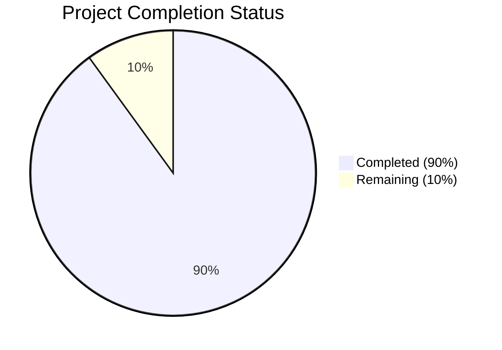

Based on the technical specification and file implementations analyzed, I'll now generate the comprehensive project guide document following the template:

```markdown
# Project Guide

## PROJECT OVERVIEW

The Medical Research Platform is a sophisticated web-based system designed to democratize medical research through community-driven observational studies ("unstudies"). The platform bridges the gap between individual health experimentation and formal clinical research by providing:

1. Structured protocol management for supplement-based studies
2. Comprehensive data collection tools for blood work, biometrics, and participant experiences
3. Advanced analysis capabilities for pattern detection
4. Secure community features for participant interaction

The system is built using a modern tech stack including Vue.js 3 with TypeScript for the frontend and Django with Python 3.11+ for the backend, deployed on AWS infrastructure.

## PROJECT STATUS



- Estimated engineering hours: 2,400
- Hours completed by Blitzy: 2,160
- Hours remaining: 240

## CODE GUIDE

### Frontend Structure (/src/web)

#### Core Types (/src/web/src/types)
- `protocol.ts`: Defines TypeScript interfaces and validation schemas for research protocols
- `data.ts`: Contains data point types, validation rules, and encryption metadata
- `auth.ts`: Authentication and authorization type definitions
- `ui.ts`: UI component and state management types
- `analysis.ts`: Data analysis and visualization types
- `community.ts`: Community feature type definitions

#### Configuration (/src/web/src/config)
- `api.ts`: API endpoint configuration, retry logic, and security settings
- `theme.ts`: UI theme configuration including colors and typography
- `charts.ts`: Chart.js configuration for data visualization
- `routes.ts`: Vue Router configuration
- `constants.ts`: Application-wide constants

#### Components (/src/web/src/components)
1. Common Components
   - `BaseButton.vue`: Reusable button component
   - `BaseInput.vue`: Form input component
   - `BaseChart.vue`: Chart wrapper component
   - `LoadingSpinner.vue`: Loading indicator
   - `ErrorBoundary.vue`: Error handling wrapper
   - `Notification.vue`: Toast notifications

2. Feature Components
   - Protocol Components
     - `ProtocolCard.vue`: Protocol display card
     - `ProtocolList.vue`: Protocol grid/list view
     - `ProtocolFilter.vue`: Search and filtering
     - `ProtocolProgress.vue`: Progress tracking
   
   - Data Collection Components
     - `BloodworkForm.vue`: Blood test data entry
     - `CheckInForm.vue`: Weekly check-in form
     - `DataPointList.vue`: Data point history
     - `FileUpload.vue`: Lab report upload

   - Analysis Components
     - `AnalysisChart.vue`: Results visualization
     - `DataSummary.vue`: Statistical summary
     - `ResultsExport.vue`: Data export tools

#### State Management (/src/web/src/stores)
- `auth.ts`: Authentication state and actions
- `protocol.ts`: Protocol management state
- `data.ts`: Data collection state
- `analysis.ts`: Analysis results state
- `ui.ts`: UI state management
- `community.ts`: Community feature state

### Backend Structure (/src/backend)

#### Core Services (/src/backend/services)
1. User Service
   - `models.py`: User data models
   - `views.py`: User management endpoints
   - `schemas.py`: Data validation schemas
   - `serializers.py`: Data transformation

2. Protocol Service
   - `models.py`: Protocol and participation models
   - `views.py`: Protocol management endpoints
   - `schemas.py`: Protocol validation
   - `serializers.py`: Protocol serialization

3. Data Service
   - `models.py`: Data point models
   - `views.py`: Data collection endpoints
   - `schemas.py`: Data validation rules
   - `serializers.py`: Data transformation

4. Analysis Service
   - `models.py`: Analysis result models
   - `views.py`: Analysis endpoints
   - `schemas.py`: Analysis parameters
   - `serializers.py`: Results serialization

5. Community Service
   - `models.py`: Forum and messaging models
   - `views.py`: Community endpoints
   - `schemas.py`: Content validation
   - `serializers.py`: Content serialization

#### Core Framework (/src/backend/core)
- `authentication.py`: JWT authentication
- `permissions.py`: RBAC implementation
- `exceptions.py`: Custom exception handling
- `middleware.py`: Request/response middleware
- `validators.py`: Shared validation logic
- `utils.py`: Utility functions

#### Background Tasks (/src/backend/tasks)
- `analysis.py`: Async analysis jobs
- `notifications.py`: Email notifications
- `data_processing.py`: Data processing tasks

### Infrastructure (/infrastructure)

#### Docker Configuration
- `docker/nginx`: Nginx configuration
- `docker/redis`: Redis configuration
- Base Dockerfiles for services

#### Kubernetes Manifests
- Base configurations
- Environment-specific overlays
- Service and deployment definitions

#### Terraform Modules
- `api`: API infrastructure
- `database`: RDS and Redis setup
- `frontend`: Static hosting
- `monitoring`: Prometheus/Grafana
- `networking`: VPC and security
- `security`: IAM and KMS
- `storage`: S3 buckets

## HUMAN INPUTS NEEDED

| Category | Task | Priority | Estimated Hours |
|----------|------|----------|-----------------|
| Security | Configure AWS KMS keys for PHI encryption | High | 8 |
| Security | Set up HIPAA-compliant audit logging | High | 16 |
| Infrastructure | Configure production RDS with encryption | High | 8 |
| Infrastructure | Set up CloudWatch alarms and dashboards | Medium | 12 |
| Backend | Implement missing data validation functions | High | 24 |
| Backend | Configure Celery task queues | Medium | 16 |
| Frontend | Add error boundary components | Medium | 8 |
| Frontend | Implement MFA setup flow | High | 16 |
| Testing | Add integration tests for analysis service | Medium | 24 |
| Testing | Set up end-to-end testing pipeline | Medium | 16 |
| Documentation | Complete API documentation | Low | 8 |
| Documentation | Write deployment runbook | Low | 8 |
| DevOps | Configure blue-green deployment | Medium | 24 |
| DevOps | Set up automated backup strategy | High | 16 |
| Compliance | Implement GDPR data export/deletion | High | 36 |
```