# Technical Specifications

# 1. INTRODUCTION

## 1.1 Executive Summary

The Medical Research Platform is a web-based system designed to democratize medical research through community-driven observational studies ("unstudies"). The platform addresses the critical gap between individual health experimentation and formal clinical research by providing structured protocols, data collection tools, and analysis capabilities. Primary stakeholders include study participants, protocol creators, and supplement company partners, with an expected impact of generating valuable real-world health intervention data while reducing barriers to participation in medical research.

## 1.2 System Overview

### Project Context

| Aspect | Description |
| --- | --- |
| Market Position | First-to-market community-driven medical research platform focusing on supplement interventions |
| Current Landscape | Fragmented ecosystem of informal self-experimentation and costly clinical trials |
| Enterprise Integration | Standalone system with planned integrations for laboratory services and supplement fulfillment |

### High-Level Description

| Component | Implementation |
| --- | --- |
| Protocol Management | Standardized templates with safety parameters and data collection requirements |
| Data Collection | Structured capture of blood work, biometrics, and participant experiences |
| Analysis Engine | Signal detection and pattern recognition across participant cohorts |
| Community Features | Moderated forums and direct messaging for participant interaction |

### Success Criteria

| Metric | Target |
| --- | --- |
| Active Protocols | 50+ within first year |
| Participant Retention | 80% completion rate |
| Data Quality | 95% compliance with protocol requirements |
| User Growth | 1,000 active participants in 6 months |
| Partner Engagement | 5 verified supplement companies onboarded |

## 1.3 Scope

### In-Scope Elements

#### Core Features and Functionalities

| Category | Components |
| --- | --- |
| Protocol Creation | - Standardized templates<br>- Safety parameter definition<br>- Data collection requirements<br>- Timeline management |
| Data Collection | - Blood test results<br>- Weekly check-ins<br>- Biometric tracking<br>- Experience reports |
| Analysis Tools | - Basic statistical analysis<br>- Results classification<br>- Pattern detection<br>- Data visualization |
| Community Tools | - Protocol-specific forums<br>- Direct messaging<br>- Experience sharing<br>- Content moderation |

#### Implementation Boundaries

| Boundary Type | Coverage |
| --- | --- |
| System Access | Web-based platform with responsive design |
| User Groups | Adult participants (18-65), protocol creators, supplement partners |
| Geographic Scope | United States initial launch |
| Data Domains | Blood work, biometrics, subjective reporting |

### Out-of-Scope Elements

- IRB-approved formal clinical trials
- Mobile native applications
- Integration with electronic health records
- Real-time biometric monitoring
- International markets and languages
- Prescription medication protocols
- Advanced statistical analysis tools
- Automated protocol creation
- Third-party API access
- Custom laboratory integrations

# 2. SYSTEM ARCHITECTURE

## 2.1 High-Level Architecture

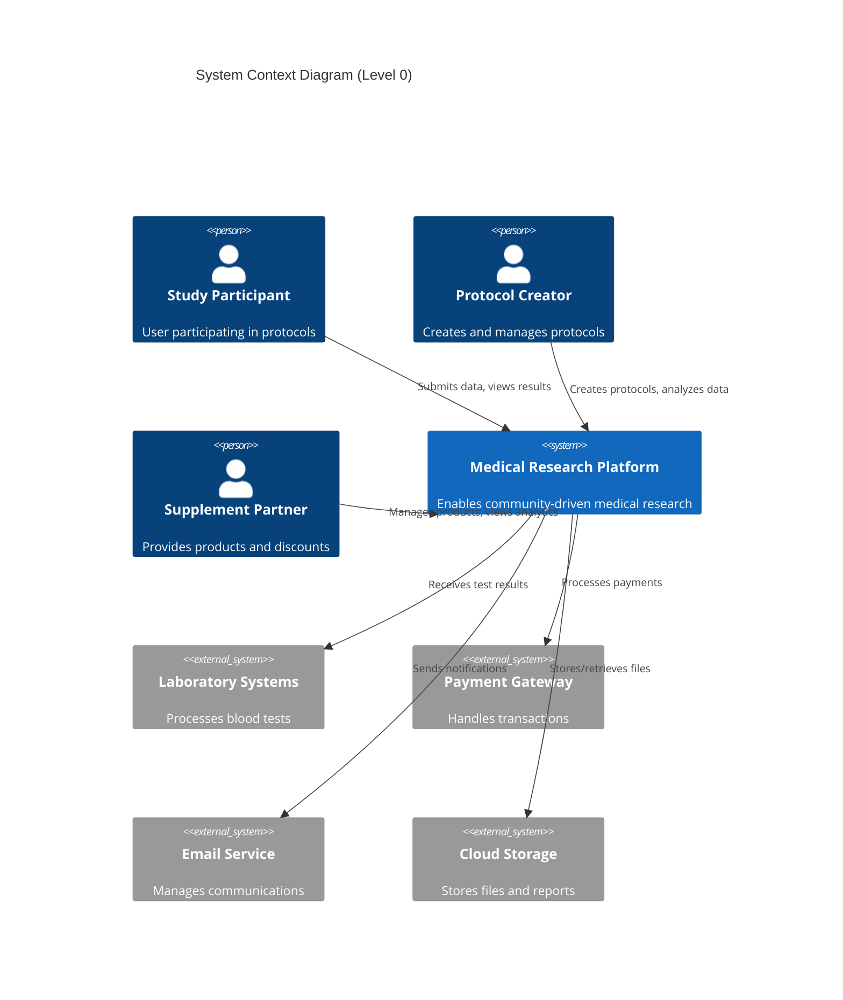

```mermaid
C4Container
    title Container Diagram (Level 1)
    
    Container(web, "Web Application", "Vue.js", "User interface")
    Container(api, "API Gateway", "Kong", "API management and routing")
    
    Container_Boundary(services, "Core Services") {
        Container(user, "User Service", "Django", "User management")
        Container(protocol, "Protocol Service", "Django", "Protocol operations")
        Container(data, "Data Service", "Django", "Data collection")
        Container(analysis, "Analysis Service", "Django", "Data analysis")
        Container(community, "Community Service", "Django", "Forums and messaging")
    }
    
    ContainerDb(db, "Primary Database", "PostgreSQL", "Stores application data")
    ContainerDb(cache, "Cache", "Redis", "Session and data caching")
    ContainerDb(queue, "Message Queue", "RabbitMQ", "Event processing")
    
    Rel(web, api, "Uses", "HTTPS")
    Rel(api, user, "Routes", "HTTP")
    Rel(api, protocol, "Routes", "HTTP")
    Rel(api, data, "Routes", "HTTP")
    Rel(api, analysis, "Routes", "HTTP")
    Rel(api, community, "Routes", "HTTP")
    
    Rel(services, db, "Reads/Writes", "SQL")
    Rel(services, cache, "Reads/Writes", "Redis Protocol")
    Rel(services, queue, "Publishes/Subscribes", "AMQP")
```

## 2.2 Component Details

### Core Services

| Service | Purpose | Technology Stack | Key Interfaces | Data Storage | Scaling Strategy |
| --- | --- | --- | --- | --- | --- |
| User Service | Identity and profile management | Django, JWT | REST API | PostgreSQL | Horizontal |
| Protocol Service | Protocol creation and management | Django, Celery | REST API | PostgreSQL, S3 | Horizontal |
| Data Service | Data collection and validation | Django, Pandas | REST API | PostgreSQL, S3 | Horizontal |
| Analysis Service | Statistical analysis and reporting | Django, NumPy | REST API | PostgreSQL | Vertical |
| Community Service | Forums and messaging | Django, WebSocket | REST API, WS | PostgreSQL | Horizontal |

### Infrastructure Components

| Component | Technology | Purpose | Configuration |
| --- | --- | --- | --- |
| Load Balancer | AWS ALB | Traffic distribution | Auto-scaling groups |
| API Gateway | Kong | API management | Rate limiting, auth |
| Cache | Redis | Performance optimization | 2-node cluster |
| Message Queue | RabbitMQ | Async processing | 3-node cluster |
| Object Storage | AWS S3 | File storage | Versioning enabled |

## 2.3 Technical Decisions

### Architecture Style: Monolith

| Aspect | Decision | Rationale |
| --- | --- | --- |
|  |  |  |
|  |  |  |
|  |  |  |
|  |  |  |

### Data Storage Solutions

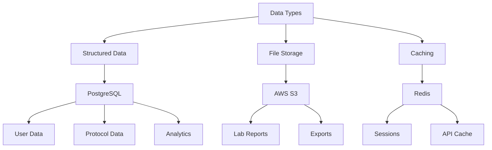

## 2.4 Cross-Cutting Concerns

### Monitoring and Security

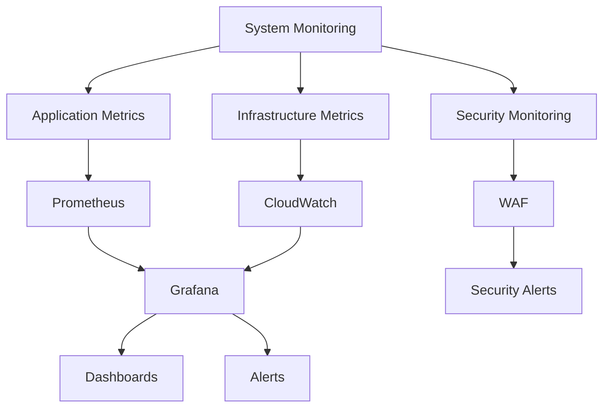

### Error Handling and Logging

| Layer | Implementation | Storage | Retention |
| --- | --- | --- | --- |
| Application | Structured JSON | ELK Stack | 30 days |
| Infrastructure | CloudWatch | S3 Archive | 1 year |
| Security | WAF Logs | S3 Archive | 2 years |
| Audit | Event Logs | PostgreSQL | 7 years |

## 2.5 Deployment Architecture

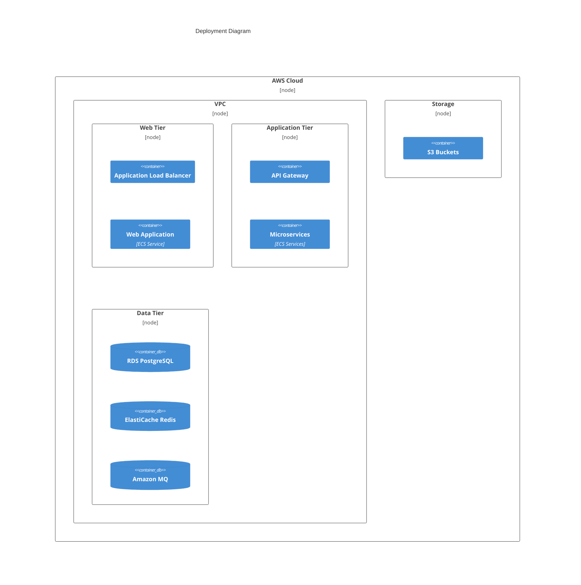

# 3. SYSTEM COMPONENTS ARCHITECTURE

## 3.1 User Interface Design

### Design System Specifications

| Component | Specification | Implementation |
| --- | --- | --- |
| Typography | Primary: Inter, Secondary: Open Sans | Font weights: 400, 500, 600, 700 |
| Color Palette | Primary: #2C3E50, Secondary: #3498DB, Accent: #E74C3C | WCAG 2.1 AA compliant |
| Spacing System | 4px base unit, 8-point grid | Consistent component spacing |
| Breakpoints | Mobile: 320px, Tablet: 768px, Desktop: 1024px, Wide: 1440px | Mobile-first approach |
| Container Width | Max-width: 1200px, Gutters: 16px/24px/32px | Responsive padding |
| Elevation | 4 levels of elevation using box-shadows | Consistent depth hierarchy |

### Component Library

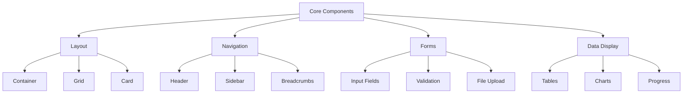

### Critical User Flows

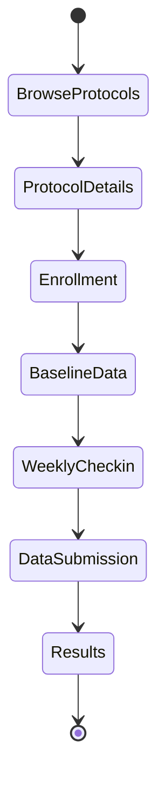

## 3.2 Database Design

### Schema Design


### Data Management Strategy

| Aspect | Strategy | Implementation |
| --- | --- | --- |
| Partitioning | Time-based partitioning for DataPoints | Monthly partitions |
| Indexing | B-tree indexes for lookups, GiST for JSON | Covering indexes for common queries |
| Archival | Cold storage after 2 years | S3 with Glacier transition |
| Backup | Continuous WAL archiving | Point-in-time recovery enabled |
| Encryption | AES-256 at rest, TLS in transit | AWS KMS integration |

## 3.3 API Design

### API Architecture

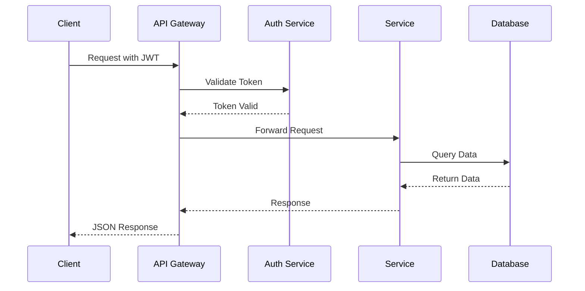

### Endpoint Specifications

| Endpoint | Method | Purpose | Request Format | Response Format |
| --- | --- | --- | --- | --- |
| /api/v1/protocols | GET | List protocols | Query params | JSON array |
| /api/v1/protocols/{id} | GET | Protocol details | Path param | JSON object |
| /api/v1/participations | POST | Enroll in protocol | JSON body | JSON object |
| /api/v1/data-points | POST | Submit data | JSON body | JSON object |
| /api/v1/analysis/{id} | GET | Get results | Path param | JSON object |

### Authentication & Authorization

| Security Layer | Implementation | Details |
| --- | --- | --- |
| Authentication | JWT with RSA-256 | 1-hour access tokens |
| Authorization | RBAC with scopes | Role-based permissions |
| Rate Limiting | Token bucket | 100 requests/minute |
| API Versioning | URI versioning | Major version in path |

# 4. TECHNOLOGY STACK

## 4.1 PROGRAMMING LANGUAGES

| Platform | Language | Version | Justification |
| --- | --- | --- | --- |
| Backend | Python | 3.11+ | - Strong data science libraries<br>- Extensive healthcare integrations<br>- Rapid development capabilities |
| Frontend | TypeScript | 5.0+ | - Type safety for complex data models<br>- Enhanced developer productivity<br>- Better maintainability |
| Database | SQL | PostgreSQL 15+ | - HIPAA compliance capabilities<br>- Complex query requirements<br>- Data integrity features |
| Infrastructure | HCL | Terraform 1.5+ | - Infrastructure as code requirements<br>- AWS ecosystem integration<br>- Version control support |

## 4.2 FRAMEWORKS & LIBRARIES

### Core Frameworks

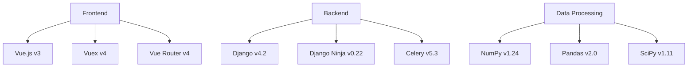

### Supporting Libraries

| Category | Library | Version | Purpose |
| --- | --- | --- | --- |
| UI Components | Vuetify | 3.3+ | Material Design implementation |
| Data Visualization | Chart.js | 4.3+ | Protocol results visualization |
| API Documentation | OpenAPI | 3.1+ | API specification and documentation |
| Testing | Jest/PyTest | 29.5+/7.4+ | Unit and integration testing |
| Authentication | JWT | 2.7+ | Token-based authentication |

## 4.3 DATABASES & STORAGE

### Data Architecture

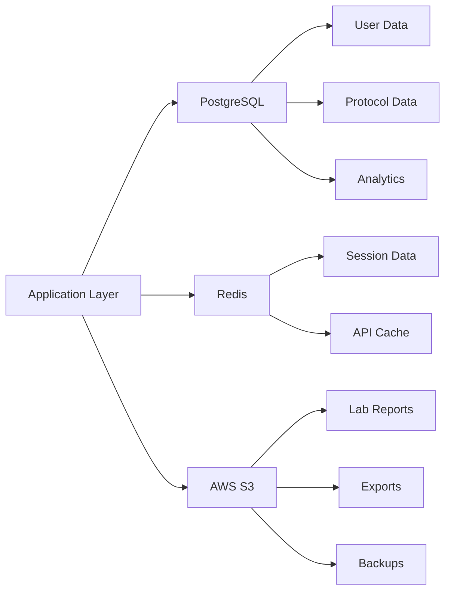

### Storage Solutions

| Type | Technology | Version | Use Case |
| --- | --- | --- | --- |
| Primary Database | PostgreSQL | 15+ | Transactional data |
| Cache | Redis | 7.0+ | Session and API caching |
| Object Storage | AWS S3 | - | File storage and backups |
| Time Series | TimescaleDB | 2.11+ | Protocol metrics |
| Search | Elasticsearch | 8.9+ | Protocol discovery |

## 4.4 THIRD-PARTY SERVICES

### Service Integration Architecture

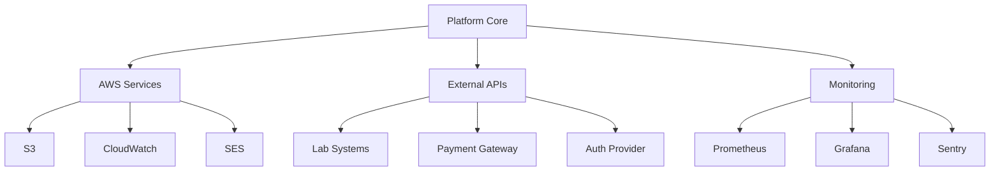

### Service Matrix

| Category | Service | Purpose | SLA Requirement |
| --- | --- | --- | --- |
| Cloud Infrastructure | AWS | Hosting and services | 99.9% uptime |
| Email | AWS SES | Transactional emails | 99% delivery |
| Monitoring | Prometheus/Grafana | System monitoring | 99.9% uptime |
| Error Tracking | Sentry | Error monitoring | 99.5% uptime |
| CDN | CloudFront | Content delivery | 99.9% uptime |

## 4.5 DEVELOPMENT & DEPLOYMENT

### Development Pipeline

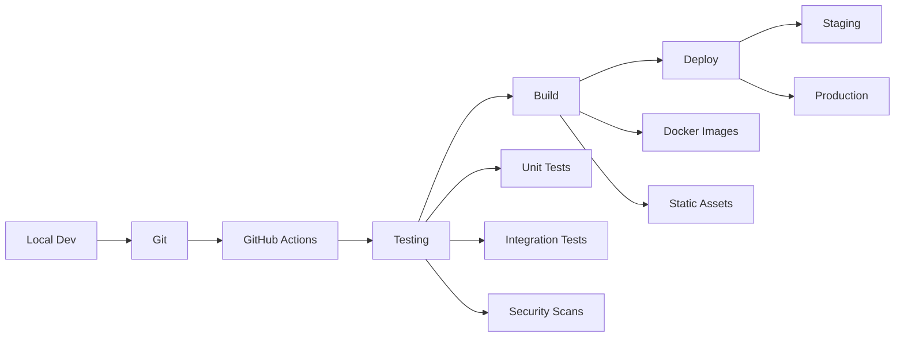

### Tools and Requirements

| Category | Tool | Version | Purpose |
| --- | --- | --- | --- |
| Version Control | Git | 2.40+ | Source control |
| CI/CD | GitHub Actions | - | Automation pipeline |
| Containerization | Docker | 24.0+ | Application packaging |
| Container Orchestration | ECS | - | Container management |
| Infrastructure | Terraform | 1.5+ | Infrastructure as code |
| Code Quality | SonarQube | 9.9+ | Code analysis |

# 5. SYSTEM DESIGN

## 5.1 User Interface Design

### Core Layout Structure

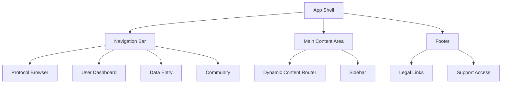

### Key Interface Components

| Component | Purpose | Implementation |
| --- | --- | --- |
| Protocol Browser | Discovery and enrollment | Grid layout with filtering |
| Data Entry Forms | Structured data collection | Multi-step wizard interface |
| Results Dashboard | Progress visualization | Chart.js data displays |
| Community Forums | User interaction | Threaded discussion layout |

### Responsive Breakpoints

| Breakpoint | Width | Layout Changes |
| --- | --- | --- |
| Mobile | \< 768px | Single column, hamburger menu |
| Tablet | 768px - 1024px | Two column, condensed navigation |
| Desktop | \> 1024px | Full layout with sidebar |

## 5.2 Database Design

### Core Schema

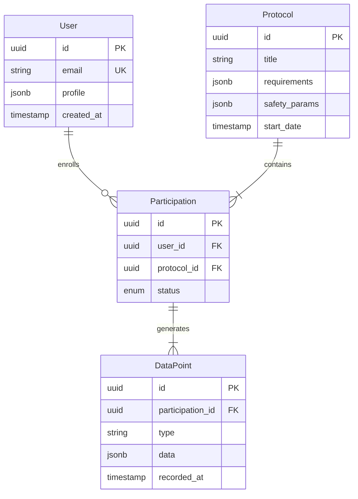

### Data Partitioning Strategy

| Table | Partition Key | Strategy | Retention |
| --- | --- | --- | --- |
| DataPoint | recorded_at | Monthly | 2 years |
| Participation | created_at | Quarterly | 7 years |
| Protocol | status | List | Indefinite |

## 5.3 API Design

### RESTful Endpoints

| Endpoint | Method | Purpose | Request Format |
| --- | --- | --- | --- |
| /api/v1/protocols | GET | List protocols | Query parameters |
| /api/v1/protocols/{id} | GET | Protocol details | Path parameter |
| /api/v1/participations | POST | Enroll in protocol | JSON body |
| /api/v1/data-points | POST | Submit data | JSON body |

### Authentication Flow

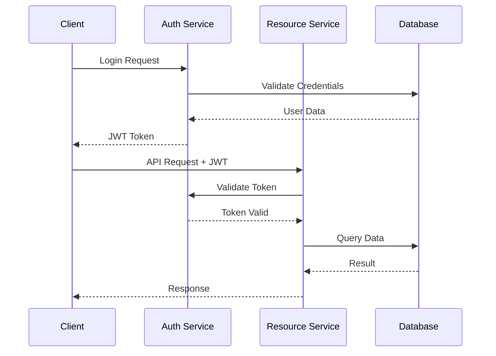

### WebSocket Events

| Event | Direction | Purpose | Payload |
| --- | --- | --- | --- |
| protocol.update | Server→Client | Protocol changes | Protocol ID, changes |
| data.submission | Client→Server | Real-time data | Data point object |
| safety.alert | Server→Client | Safety notifications | Alert details |

## 5.4 Service Architecture

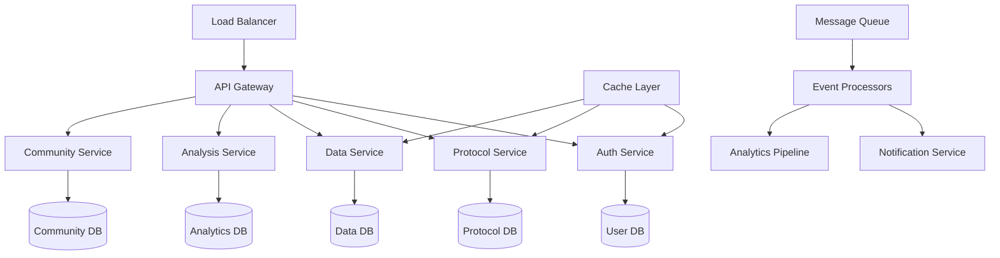

### Service Responsibilities

| Service | Primary Functions | Dependencies |
| --- | --- | --- |
| Auth Service | User management, authentication | Redis, PostgreSQL |
| Protocol Service | Protocol CRUD, enrollment | PostgreSQL, S3 |
| Data Service | Data collection, validation | PostgreSQL, Redis |
| Analysis Service | Statistical processing | PostgreSQL, NumPy |
| Community Service | Forums, messaging | PostgreSQL, WebSocket |

# 6. USER INTERFACE DESIGN

## 6.1 Design System

| Component | Implementation | Notes |
| --- | --- | --- |
| Typography | Inter (Headers), Open Sans (Body) | WCAG 2.1 AA compliant |
| Colors | Primary: #2C3E50, Secondary: #3498DB, Accent: #E74C3C | Contrast ratio ≥ 4.5:1 |
| Spacing | 8px base unit, 16/24/32/48px increments | Consistent component spacing |
| Breakpoints | Mobile: 320px, Tablet: 768px, Desktop: 1024px | Mobile-first approach |

## 6.2 Core Layouts

### Protocol Browser

```
+----------------------------------------------------------+
|  [#] Medical Research Platform                    [@] [=]  |
+----------------------------------------------------------+
|  [Search Protocols...]                    [Filter v] [+]   |
|                                                           |
|  +------------------------+  +------------------------+    |
|  | Protocol Card          |  | Protocol Card          |   |
|  | Title: Vitamin D Study |  | Title: Omega-3 Trial   |   |
|  | [====] Progress: 45%   |  | [====] Progress: 12%   |   |
|  | [*] Participants: 32   |  | [*] Participants: 15   |   |
|  | [!] Duration: 12 weeks |  | [!] Duration: 8 weeks  |   |
|  | [View Details]         |  | [View Details]         |   |
|  +------------------------+  +------------------------+    |
|                                                           |
|  [< Prev]  Page 1 of 5  [Next >]                         |
+----------------------------------------------------------+
```

### Data Entry Dashboard

```
+----------------------------------------------------------+
|  Protocol: Vitamin D Study                       [?] [x]   |
+----------------------------------------------------------+
|  Week 4 of 12                                             |
|  [=========>          ] 45% Complete                      |
|                                                           |
|  Required Actions:                                        |
|  [ ] Blood Work Upload                                    |
|  +----------------+                                       |
|  | [^] Drop File  |  No file selected                    |
|  +----------------+                                       |
|                                                           |
|  Weekly Check-in:                                         |
|  Energy Level: ( )1 ( )2 (*)3 ( )4 ( )5                  |
|  Sleep Quality: ( )1 (*)2 ( )3 ( )4 ( )5                 |
|  Side Effects:  [......................................]  |
|                                                           |
|  [Save Draft]                    [Submit Data]            |
+----------------------------------------------------------+
```

### Results View

```
+----------------------------------------------------------+
|  Protocol Results                              [Export v]  |
+----------------------------------------------------------+
|  +----------------------+  +----------------------+        |
|  | Vitamin D Levels     |  | Reported Energy     |       |
|  | Chart               |  | Chart               |       |
|  | [Graph Area]        |  | [Graph Area]        |       |
|  |                     |  |                     |       |
|  | Y: ng/mL           |  | Y: Score (1-5)      |       |
|  | X: Weeks           |  | X: Weeks            |       |
|  +----------------------+  +----------------------+        |
|                                                           |
|  Statistical Summary:                                     |
|  +--------------------------------------------------+   |
|  | Metric          | Baseline | Current | Change     |   |
|  |-----------------|----------|---------|------------|   |
|  | Vitamin D       | 25 ng/mL | 45 ng/mL| +20 ng/mL |   |
|  | Energy Score    | 2.5      | 3.8     | +1.3      |   |
|  | Sleep Quality   | 2.1      | 3.2     | +1.1      |   |
|  +--------------------------------------------------+   |
|                                                           |
|  [Download Full Report]                                   |
+----------------------------------------------------------+
```

## 6.3 Component Legend

### Navigation Icons

- \[#\] Main Dashboard
- \[@\] User Profile
- \[=\] Settings Menu
- \[?\] Help/Info
- \[x\] Close/Exit
- \[\<\] \[\>\] Pagination
- \[^\] Upload

### Interactive Elements

- \[...\] Text Input Field
- \[ \] Checkbox
- (\*) Selected Radio
- ( ) Unselected Radio
- \[Button\] Action Button
- \[v\] Dropdown Menu
- \[====\] Progress Bar

### Status Indicators

- \[!\] Warning/Important
- \[\*\] Featured/Highlighted
- \[Graph Area\] Data Visualization

## 6.4 Responsive Behavior

| Breakpoint | Layout Changes |
| --- | --- |
| Mobile (\<768px) | - Single column layout<br>- Stacked cards<br>- Collapsible menus<br>- Full-width inputs |
| Tablet (768-1024px) | - Two column card grid<br>- Side navigation<br>- Condensed charts |
| Desktop (\>1024px) | - Three column card grid<br>- Expanded charts<br>- Persistent navigation |

## 6.5 Interaction States

| Element | States | Visual Indicator |
| --- | --- | --- |
| Buttons | Hover, Active, Disabled | Color change, opacity |
| Inputs | Focus, Error, Success | Border color, icon |
| Cards | Hover, Selected | Shadow, border |
| Links | Hover, Visited | Underline, color |
| Progress | In Progress, Complete | Fill color, animation |

# 7. SECURITY CONSIDERATIONS

## 7.1 Authentication and Authorization

### Authentication Methods

| Method | Implementation | Use Case |
| --- | --- | --- |
| Password-based | Argon2id hashing with salt | Primary user login |
| Multi-factor | TOTP via authenticator apps | Required for protocol creators and partners |
| OAuth 2.0 | Integration with Google, Apple | Alternative login option |
| JWT | RS256 signing | API authentication |
| Session Management | Redis with 24h expiry | Web application state |

### Role-Based Access Control

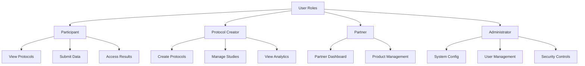

## 7.2 Data Security

### Encryption Standards

| Data State | Method | Key Management |
| --- | --- | --- |
| At Rest | AES-256-GCM | AWS KMS with automatic rotation |
| In Transit | TLS 1.3 | Managed certificates with auto-renewal |
| Database | Transparent Data Encryption | PostgreSQL native encryption |
| File Storage | S3 server-side encryption | S3-managed keys with versioning |
| PHI Fields | Field-level encryption | Application-managed keys |

### Data Classification

| Level | Description | Security Controls |
| --- | --- | --- |
| Public | Protocol descriptions, general info | Basic access controls |
| Confidential | User profiles, participation data | Role-based access, encryption |
| Restricted | Health records, lab results | Field-level encryption, audit logging |
| Critical | Authentication credentials | Hash+salt, secure key storage |

## 7.3 Security Protocols

### Security Monitoring

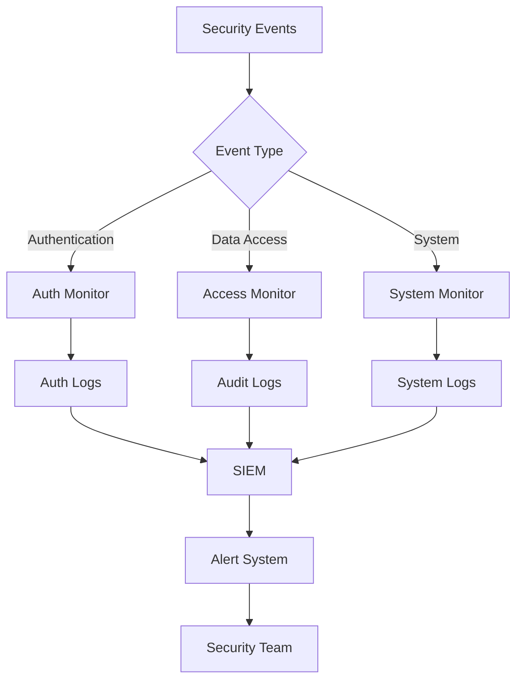

### Security Controls

| Control Type | Implementation | Monitoring |
| --- | --- | --- |
| WAF | AWS WAF with custom rules | Real-time threat detection |
| DDoS Protection | AWS Shield Standard | Traffic analysis |
| Rate Limiting | Kong Gateway (100 req/min) | Usage metrics |
| Input Validation | Server-side validation with sanitization | Validation failures |
| Session Management | Redis with secure cookie settings | Session analytics |

### Compliance Requirements

| Standard | Requirements | Implementation |
| --- | --- | --- |
| HIPAA | PHI protection | - Encryption at rest and transit<br>- Access controls<br>- Audit logging |
| GDPR | Data privacy | - Consent management<br>- Data portability<br>- Right to erasure |
| SOC 2 | Security controls | - Security monitoring<br>- Incident response<br>- Change management |

### Security Response Plan

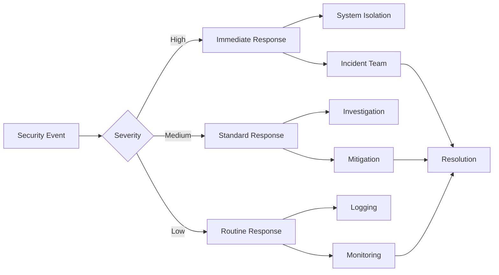

### Vulnerability Management

| Activity | Frequency | Tools |
| --- | --- | --- |
| Security Scanning | Weekly | SonarQube, OWASP ZAP |
| Dependency Audits | Daily | npm audit, safety |
| Penetration Testing | Quarterly | Third-party service |
| Code Reviews | Per commit | Automated + manual review |
| Security Patching | As needed | Automated deployment |

# 8. INFRASTRUCTURE

## 8.1 Deployment Environment

| Environment | Purpose | Configuration |
| --- | --- | --- |
| Development | Local development and testing | Docker Compose with local services |
| Staging | Pre-production testing | AWS ECS with replicated production setup |
| Production | Live system | AWS ECS in multi-AZ configuration |

### Production Architecture

```mermaid
graph TD
    A[Route 53] --> B[CloudFront]
    B --> C[ALB]
    C --> D[ECS Cluster]
    D --> E[Web Service]
    D --> F[API Services]
    D --> G[Background Workers]
    
    F --> H[(RDS Multi-AZ)]
    F --> I[(ElastiCache)]
    G --> J[SQS Queues]
    
    K[AWS WAF] --> B
    L[CloudWatch] --> D
    M[AWS Shield] --> B
```

## 8.2 Cloud Services

| Service | Usage | Justification |
| --- | --- | --- |
| AWS ECS | Container orchestration | Cost-effective for initial scale, simpler than EKS |
| RDS PostgreSQL | Primary database | HIPAA compliance, managed service benefits |
| ElastiCache Redis | Session/cache storage | High performance, managed failover |
| S3 | File storage | HIPAA eligible, cost-effective storage |
| CloudFront | CDN | Global distribution, WAF integration |
| SQS | Message queuing | Managed service, high availability |
| CloudWatch | Monitoring | Integrated monitoring and alerting |
| WAF | Security | DDoS protection, security rules |

## 8.3 Containerization

### Docker Configuration

```mermaid
graph TD
    A[Base Image] --> B[Python Base]
    A --> C[Node Base]
    
    B --> D[API Services]
    B --> E[Celery Workers]
    C --> F[Vue.js Frontend]
    
    D --> G[Production Image]
    E --> G
    F --> G
```

| Image | Base | Purpose | Size Limit |
| --- | --- | --- | --- |
| api | python:3.11-slim | API services | 500MB |
| worker | python:3.11-slim | Background tasks | 500MB |
| frontend | node:18-alpine | Web application | 100MB |
| nginx | nginx:alpine | Static files/proxy | 50MB |

## 8.4 Orchestration

### ECS Configuration

| Service | Task Definition | Scaling Policy |
| --- | --- | --- |
| Web | 2 vCPU, 4GB RAM | Target tracking - 70% CPU |
| API | 2 vCPU, 4GB RAM | Target tracking - 70% CPU |
| Worker | 2 vCPU, 8GB RAM | Queue depth based |

### Service Discovery

```mermaid
graph LR
    A[Route 53] --> B[Service Discovery]
    B --> C[ECS Services]
    C --> D[Web]
    C --> E[API]
    C --> F[Worker]
    
    G[ALB] --> D
    G --> E
    H[Service Registry] --> B
```

## 8.5 CI/CD Pipeline

### Pipeline Architecture

```mermaid
flowchart TD
    A[GitHub Repository] --> B[GitHub Actions]
    B --> C{Tests Pass?}
    C -->|Yes| D[Build Images]
    C -->|No| E[Notify Team]
    
    D --> F[Push to ECR]
    F --> G{Production?}
    G -->|Yes| H[Blue/Green Deploy]
    G -->|No| I[Staging Deploy]
    
    H --> J[Health Check]
    J -->|Pass| K[Switch Traffic]
    J -->|Fail| L[Rollback]
```

### Deployment Process

| Stage | Actions | Success Criteria |
| --- | --- | --- |
| Build | - Run tests<br>- Build containers<br>- Security scan | - All tests pass<br>- No critical vulnerabilities |
| Staging | - Deploy to staging<br>- Run integration tests | - Services healthy<br>- API tests pass |
| Production | - Blue/green deployment<br>- Health checks<br>- Traffic switch | - Zero downtime<br>- All health checks pass |
| Monitoring | - Performance metrics<br>- Error rates<br>- Business metrics | - Within defined thresholds |

### Rollback Strategy

| Trigger | Action | Timeline |
| --- | --- | --- |
| Health Check Failure | Revert to previous deployment | Automatic - 5 minutes |
| Performance Degradation | Manual assessment and rollback | Manual - 15 minutes |
| Critical Bug | Immediate rollback and hotfix | Manual - 30 minutes |

# 9. APPENDICES

## 9.1 Additional Technical Information

### Development Environment Setup

```mermaid
flowchart TD
    A[Development Setup] --> B[Local Environment]
    A --> C[CI Environment]
    A --> D[Staging Environment]
    
    B --> E[Docker Compose]
    B --> F[Node.js v18+]
    B --> G[Python 3.11+]
    
    E --> H[Services]
    H --> I[PostgreSQL 15]
    H --> J[Redis 7]
    H --> K[RabbitMQ 3.11]
    
    C --> L[GitHub Actions]
    L --> M[Test Suite]
    L --> N[Linting]
    L --> O[Security Scans]
```

### Code Quality Standards

| Category | Tool | Threshold |
| --- | --- | --- |
| Test Coverage | Jest/PyTest | Minimum 80% |
| Code Complexity | SonarQube | Max cyclomatic complexity 10 |
| Documentation | JSDoc/Sphinx | All public interfaces |
| Type Safety | TypeScript/MyPy | Strict mode enabled |
| Security | OWASP Dependency Check | No high/critical vulnerabilities |

## 9.2 Glossary

| Term | Definition |
| --- | --- |
| Blue/Green Deployment | Deployment strategy using two identical environments for zero-downtime updates |
| Cyclomatic Complexity | Metric measuring code complexity through number of linearly independent paths |
| Data Point | Single unit of collected protocol data including blood work, check-ins, or biometrics |
| Field-level Encryption | Encryption of specific data fields while leaving others accessible |
| Multi-AZ | Deployment across multiple AWS Availability Zones for high availability |
| Protocol Creator | User role with permissions to design and manage research protocols |
| Signal Detection | Process of identifying meaningful patterns in protocol data |
| Time Series Data | Data points collected and organized by time of occurrence |
| Transparent Data Encryption | Database encryption at the file system level |
| Unstudy | Community-driven observational study following structured protocols |

## 9.3 Acronyms

| Acronym | Definition |
| --- | --- |
| AES | Advanced Encryption Standard |
| ALB | Application Load Balancer |
| AMQP | Advanced Message Queuing Protocol |
| API | Application Programming Interface |
| AWS | Amazon Web Services |
| CDN | Content Delivery Network |
| CRUD | Create, Read, Update, Delete |
| ECS | Elastic Container Service |
| ECR | Elastic Container Registry |
| FHIR | Fast Healthcare Interoperability Resources |
| GATT | Generic Attribute Profile |
| HIPAA | Health Insurance Portability and Accountability Act |
| JWT | JSON Web Token |
| KMS | Key Management Service |
| MFA | Multi-Factor Authentication |
| MTBF | Mean Time Between Failures |
| MTTR | Mean Time To Recovery |
| OAuth | Open Authorization |
| PHI | Protected Health Information |
| RBAC | Role-Based Access Control |
| RPO | Recovery Point Objective |
| RTO | Recovery Time Objective |
| S3 | Simple Storage Service |
| SES | Simple Email Service |
| SLA | Service Level Agreement |
| SOC | System and Organization Controls |
| SQL | Structured Query Language |
| TLS | Transport Layer Security |
| VPC | Virtual Private Cloud |
| WAF | Web Application Firewall |
| WCAG | Web Content Accessibility Guidelines |