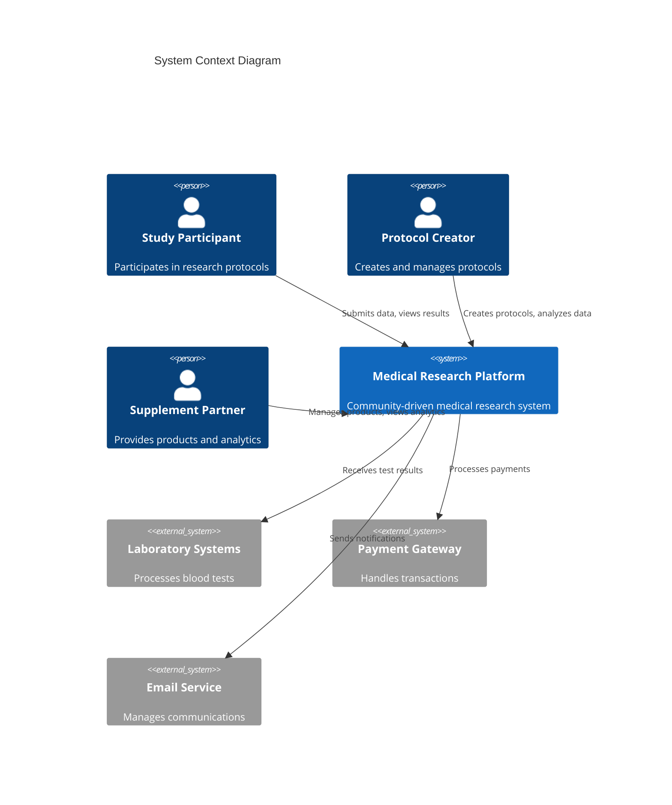
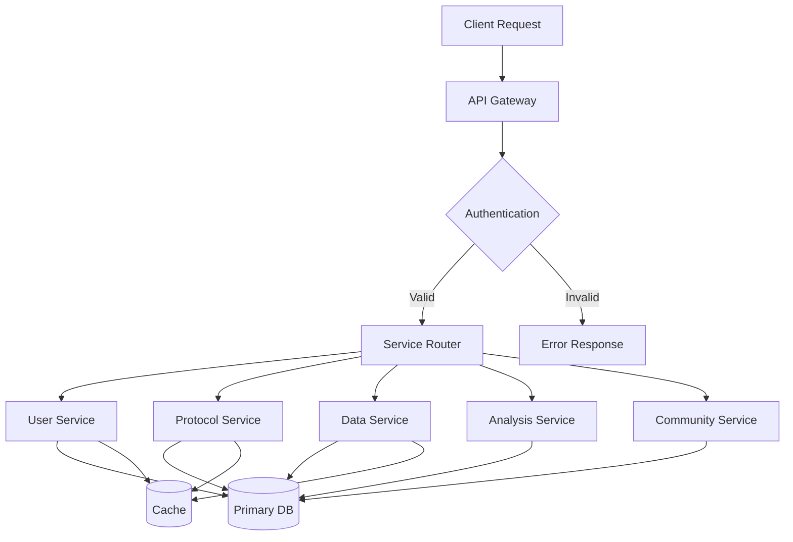
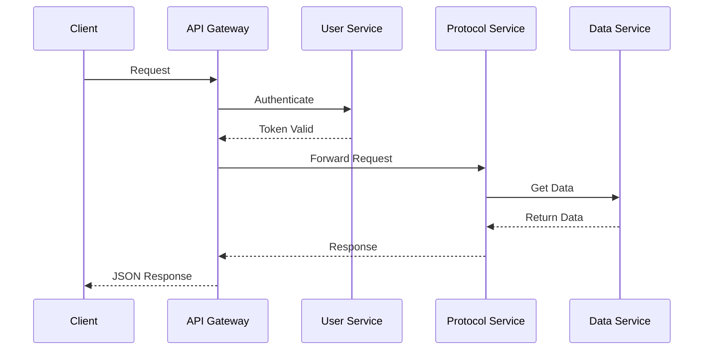
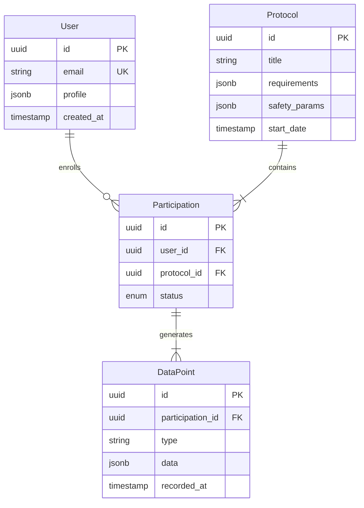
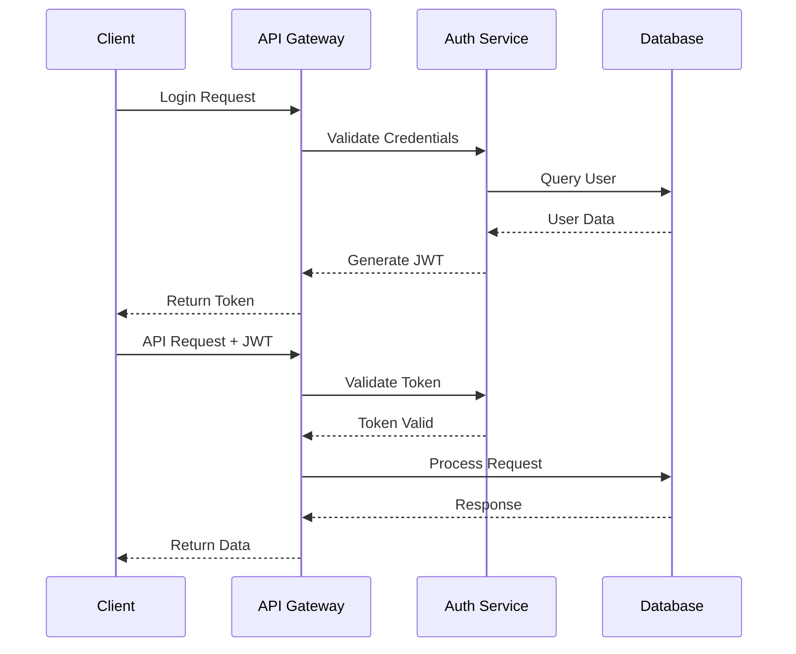
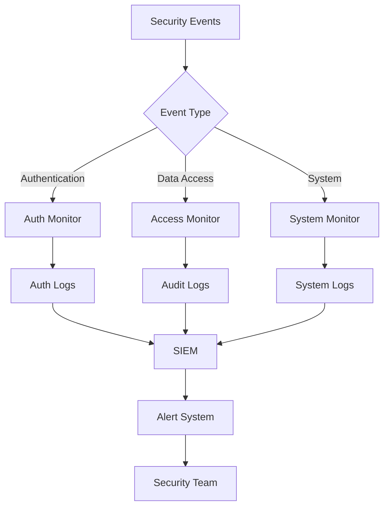
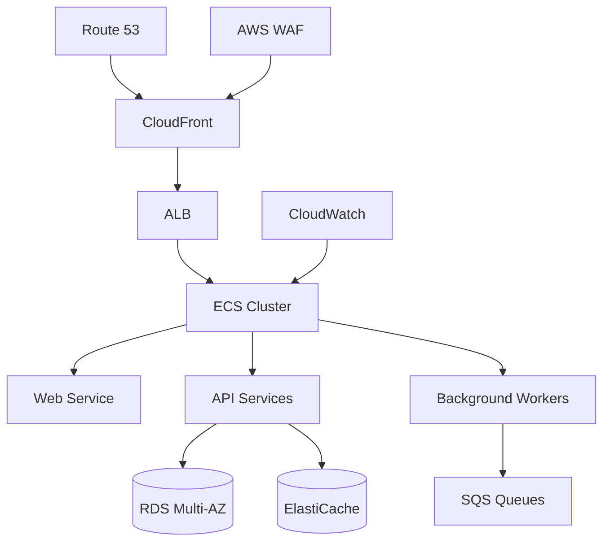

# Medical Research Platform - Backend Architecture
**Version:** 1.0  
**Last Updated:** 2024-01-20  
**Status:** Living document  
**Maintainers:** Backend Team  
**Review Cycle:** Quarterly  
**Next Review:** 2024-04-20

## Table of Contents
1. [System Overview](#1-system-overview)
2. [Core Services](#2-core-services)
3. [Data Architecture](#3-data-architecture)
4. [Security Architecture](#4-security-architecture)
5. [API Architecture](#5-api-architecture)
6. [Deployment Architecture](#6-deployment-architecture)

## 1. System Overview

### 1.1 System Context



### 1.2 Container Architecture

```mermaid
C4Container
    title Container Diagram
    
    Container(web, "Web Application", "Vue.js", "User interface")
    Container(api, "API Gateway", "Kong", "API management")
    
    Container_Boundary(services, "Core Services") {
        Container(user, "User Service", "Django", "User management")
        Container(protocol, "Protocol Service", "Django", "Protocol operations")
        Container(data, "Data Service", "Django", "Data collection")
        Container(analysis, "Analysis Service", "Django", "Data analysis")
        Container(community, "Community Service", "Django", "Forums and messaging")
    }
    
    ContainerDb(db, "Primary Database", "PostgreSQL", "Stores application data")
    ContainerDb(cache, "Cache", "Redis", "Session and data caching")
    ContainerDb(queue, "Message Queue", "RabbitMQ", "Event processing")
    
    Rel(web, api, "Uses", "HTTPS")
    Rel(api, services, "Routes", "HTTP")
    Rel(services, db, "Reads/Writes", "SQL")
    Rel(services, cache, "Reads/Writes", "Redis Protocol")
    Rel(services, queue, "Publishes/Subscribes", "AMQP")
```

### 1.3 Data Flow Patterns



## 2. Core Services

### 2.1 Service Architecture Matrix

| Service | Primary Responsibility | Dependencies | Scaling Strategy |
|---------|----------------------|--------------|------------------|
| User Service | Authentication, profiles | PostgreSQL, Redis | Horizontal |
| Protocol Service | Protocol management | PostgreSQL, S3 | Horizontal |
| Data Service | Data collection | PostgreSQL, Redis | Horizontal |
| Analysis Service | Statistical processing | PostgreSQL | Vertical |
| Community Service | Forums, messaging | PostgreSQL, WebSocket | Horizontal |

### 2.2 Service Interaction Patterns



## 3. Data Architecture

### 3.1 Database Schema



### 3.2 Data Storage Strategy

| Data Type | Storage Solution | Backup Strategy | Retention Policy |
|-----------|-----------------|-----------------|------------------|
| User Data | PostgreSQL | Daily snapshots | 7 years |
| Protocol Data | PostgreSQL | Daily snapshots | Indefinite |
| File Attachments | S3 | Cross-region replication | 7 years |
| Analytics Data | TimescaleDB | Daily snapshots | 2 years |
| Cache Data | Redis | None | 24 hours |

## 4. Security Architecture

### 4.1 Authentication Flow



### 4.2 Security Monitoring



## 5. API Architecture

### 5.1 API Layer Structure

| Layer | Implementation | Purpose |
|-------|---------------|----------|
| Gateway | Kong | Rate limiting, authentication |
| Routing | Django Ninja | Endpoint routing, validation |
| Controllers | Service Classes | Business logic |
| Models | Django ORM | Data access |

### 5.2 API Standards

- RESTful endpoint design
- JWT authentication
- Rate limiting: 100 requests/minute
- Versioning: URI-based (v1, v2)
- Response format: JSON
- Error handling: RFC 7807

## 6. Deployment Architecture

### 6.1 Container Orchestration



### 6.2 Scaling Strategy

| Service | Scaling Trigger | Scale Out | Scale In |
|---------|----------------|-----------|-----------|
| Web | CPU > 70% | +1 instance | -1 instance |
| API | CPU > 70% | +1 instance | -1 instance |
| Workers | Queue depth > 1000 | +2 instances | -1 instance |
| Database | Storage > 80% | Storage increase | N/A |

### 6.3 Monitoring and Alerting

- Infrastructure: CloudWatch metrics
- Application: Prometheus + Grafana
- Logs: ELK Stack
- Traces: AWS X-Ray
- Alerts: PagerDuty integration

---

**Note:** This architecture document is maintained by the Backend Team and reviewed quarterly. For updates or clarifications, please contact the team leads.