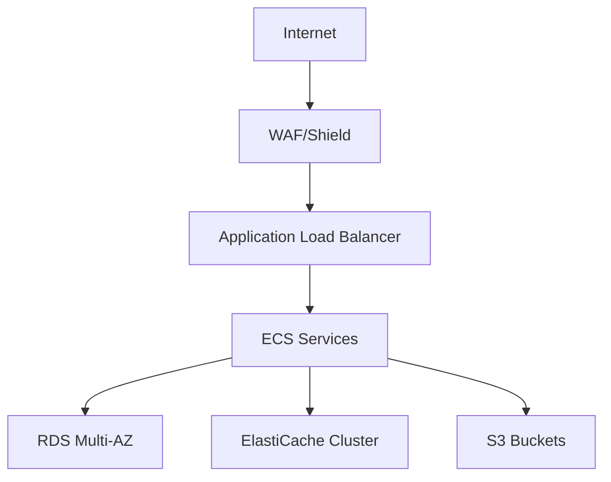
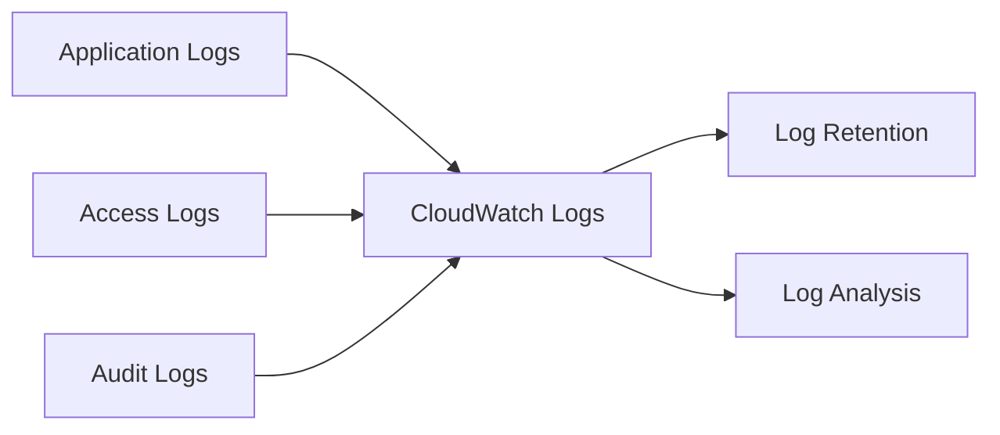
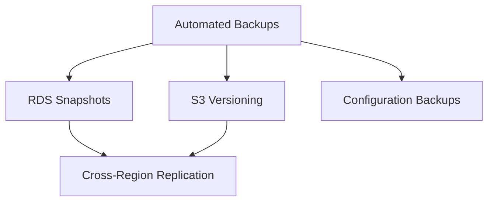

# Medical Research Platform Deployment Documentation

## Table of Contents
1. [Infrastructure Overview](#infrastructure-overview)
2. [Deployment Procedures](#deployment-procedures)
3. [Monitoring and Operations](#monitoring-and-operations)
4. [Security Procedures](#security-procedures)

## Infrastructure Overview

### AWS Architecture (HIPAA Compliant)

The Medical Research Platform utilizes a HIPAA-compliant AWS infrastructure with the following components:

#### Network Architecture
- VPC with separate public and private subnets across multiple AZs
- Private subnets for application and database layers
- Public subnets for load balancers and bastion hosts
- Network ACLs and security groups with strict access controls

#### Core Services
- **ECS Cluster**: Container orchestration
  - Production: Multi-AZ deployment with 2-4 instances
  - Auto-scaling based on CPU/Memory metrics
  - Task definitions with resource limits

- **RDS PostgreSQL**:
  - Multi-AZ deployment for high availability
  - Instance Class: db.r6g.xlarge
  - Automated backups with encryption
  - Performance Insights enabled

- **ElastiCache Redis**:
  - Cluster mode with read replicas
  - Node Type: cache.r6g.large
  - Encryption at rest and in transit
  - Auto-failover enabled

- **Application Load Balancer**:
  - SSL/TLS termination
  - WAF integration
  - Health checks configuration
  - Access logging enabled

### Security Zones



## Deployment Procedures

### Environment Setup

#### Development Environment
```yaml
# Local Development (docker-compose.yml)
services:
  api:
    build: .
    ports: ["8000:8000"]
    environment:
      DJANGO_SETTINGS_MODULE: config.settings.development
      DJANGO_DEBUG: "True"
  db:
    image: postgres:15-alpine
  cache:
    image: redis:7-alpine
```

#### Staging Environment
- Single-AZ deployment
- Reduced replica count
- Full security stack for testing

#### Production Environment
- Multi-AZ deployment
- High availability configuration
- Enhanced security measures

### Deployment Process

1. **Infrastructure Provisioning**
```bash
# Initialize Terraform
terraform init -backend-config="bucket=medical-research-tfstate"

# Plan deployment
terraform plan -var-file="production.tfvars"

# Apply changes
terraform apply -var-file="production.tfvars"
```

2. **Application Deployment**
```bash
# Build and tag container
docker build -t medical-research-platform/api:${VERSION} .
docker tag medical-research-platform/api:${VERSION} ${ECR_REPO}/api:${VERSION}

# Push to ECR
aws ecr get-login-password --region us-east-1 | docker login --username AWS --password-stdin ${ECR_REPO}
docker push ${ECR_REPO}/api:${VERSION}

# Update ECS service
aws ecs update-service --cluster medical-research --service api-service --force-new-deployment
```

## Monitoring and Operations

### Health Monitoring

#### ECS Service Monitoring
- CPU/Memory utilization
- Service health metrics
- Container insights enabled

#### Database Monitoring
- RDS Enhanced Monitoring
- Performance Insights
- Slow query logging

#### Application Monitoring
- Custom CloudWatch metrics
- API latency tracking
- Error rate monitoring

### Logging Strategy

#### Centralized Logging


#### Log Retention Policies
- Application Logs: 30 days
- Access Logs: 90 days
- Audit Logs: 7 years (HIPAA requirement)
- Security Logs: 2 years

## Security Procedures

### Access Management

#### IAM Policies
- Least privilege principle
- Role-based access control
- Regular access review

#### Secret Management
```bash
# Rotate database credentials
aws secretsmanager rotate-secret \
    --secret-id medical-research/database-credentials \
    --rotation-lambda-arn ${ROTATION_LAMBDA_ARN}

# Update application secrets
aws ecs update-service --cluster medical-research --service api-service \
    --force-new-deployment
```

### Encryption Standards

#### Data at Rest
- RDS: AES-256 encryption
- S3: Server-side encryption with KMS
- ElastiCache: Encryption enabled

#### Data in Transit
- TLS 1.3 for all external communications
- VPC encryption for internal traffic
- Certificate rotation automation

### Compliance Documentation

#### HIPAA Compliance
- Annual security assessment
- Incident response procedures
- BAA with AWS in place
- Regular compliance audits

#### Audit Procedures
- Access logging enabled
- Change tracking implemented
- Regular security scans
- Vulnerability assessments

### Backup and Recovery

#### Backup Strategy


#### Recovery Procedures
- RTO: 4 hours
- RPO: 15 minutes
- Regular recovery testing
- Documented recovery plans

## Appendix

### Quick Reference Commands

```bash
# Health check
aws ecs describe-services \
    --cluster medical-research \
    --services api-service

# Scale service
aws ecs update-service \
    --cluster medical-research \
    --service api-service \
    --desired-count 4

# View logs
aws logs get-log-events \
    --log-group-name /ecs/medical-research/api \
    --log-stream-name ${LOG_STREAM}
```

### Contact Information

- **DevOps Team**: devops@medical-research.com
- **Security Team**: security@medical-research.com
- **Emergency Contact**: oncall@medical-research.com